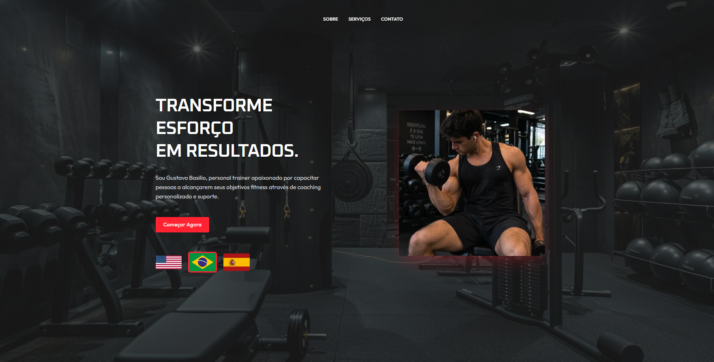
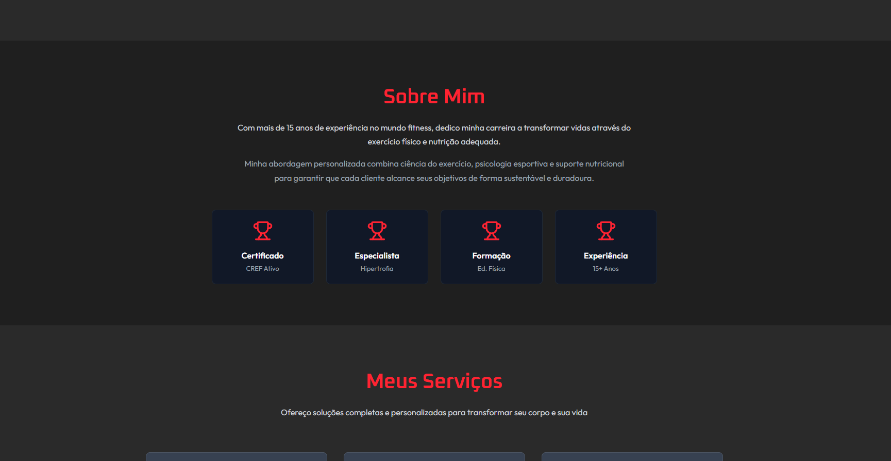
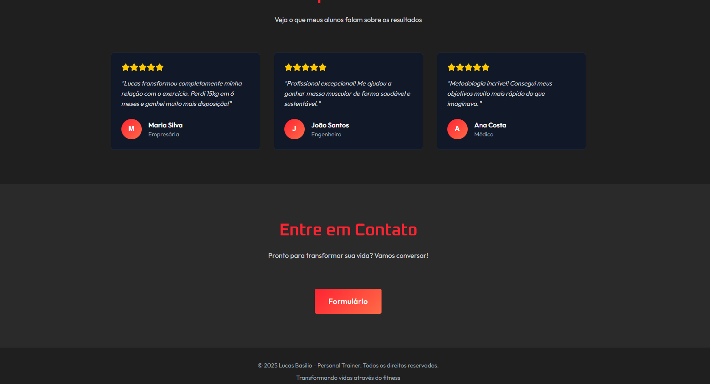

# Gustavo Basilio — Personal Trainer (Landing Page)

Landing page de uma página (one-page) para personal trainer, voltada a um público internacional. A página é **trilíngue** — português, inglês e espanhol — com troca de idioma em tempo real pelas bandeiras.

> **Status:** projeto concluído e publicado em **[https://landingpage-nine-delta-23.vercel.app/](https://landingpage-nine-delta-23.vercel.app/)**

---

## Preview







---

## Funcionalidades

- **Troca de idioma (PT / EN / ES)** — dicionário de traduções em memória, com estado no cliente; todos os textos da página trocam ao clicar na bandeira correspondente.
- **Navegação com scroll suave** — menu fixo no topo que rola até as seções `Sobre`, `Serviços` e `Contato`, com offset para não ficar embaixo do header.
- **Layout responsivo** — versões separadas para desktop (grid de 2 colunas) e mobile (stack vertical reordenado: título → foto → descrição → CTA → bandeiras).
- **Seções da página:** Hero, Estatísticas (alunos, anos de experiência, taxa de sucesso, suporte), Sobre, Serviços (Personal Training, Consultoria Online, Preparação Física), Depoimentos e Contato.
- **Captação de leads** — o botão de contato abre um Google Forms em nova aba.
- **Fontes otimizadas** — `Oxanium` (títulos) e `Outfit` (corpo) carregadas via `next/font`, e imagens via `next/image`.

## Stack

| Camada | Tecnologia |
| --- | --- |
| Framework | Next.js 16 (App Router) |
| Linguagem | TypeScript 5 |
| UI | React 19 |
| Estilo | Tailwind CSS 4 (via `@tailwindcss/postcss`) + CSS customizado (`landing.css`) |
| Ícones | lucide-react |
| Lint | ESLint 9 (`eslint-config-next`) |
| Deploy | Vercel |


## Rodando localmente

Pré-requisito: Node.js 18.18+ (recomendado 20+).

```bash
git clone https://github.com/gbasilio321/landingpage.git
cd landingpage
npm install
npm run dev
```

Acesse http://localhost:3000.

### Scripts

| Comando | O que faz |
| --- | --- |
| `npm run dev` | servidor de desenvolvimento |
| `npm run build` | build de produção |
| `npm start` | sobe o build de produção |
| `npm run lint` | roda o ESLint |

Não há variáveis de ambiente necessárias.

## Como editar o conteúdo

- **Textos e traduções:** todos ficam no objeto `translations` no topo de `src/app/page.tsx`. Cada chave tem as três variantes (`pt`, `en`, `es`) — ao adicionar um texto novo, preencha os três idiomas, senão a própria chave aparece na tela como fallback.
- **Idioma inicial:** `useState<Language>('pt')` em `page.tsx`.
- **Link do formulário de contato:** URL do Google Forms na seção `#contato` de `page.tsx`.
- **Números das estatísticas** (200+, 15+, 98%, 24/7) e **depoimentos**: estão escritos direto no JSX das respectivas seções.
- **Imagens:** troque os arquivos em `public/` mantendo os nomes, ou atualize os `src` no `page.tsx`.

## Deploy

O projeto está hospedado na Vercel — qualquer push na branch principal dispara um novo deploy. Como é um app Next.js padrão sem env vars, não há configuração extra necessária.
